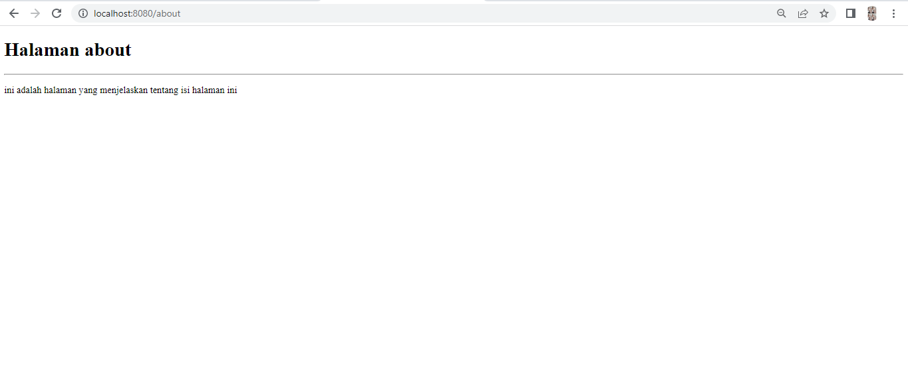

| Nama          | Nia Dwi Rahayu |
|-------------- | ---------------|
| NIM           | 312010298      |
| Kelas         | TI.20.A2       |
| Matkul        | Pemograman web |

# Pratikum 11
Dipertemuan kali ini kita akan mempelajari PHP FRAMEWORK (CODEIGNITER) dan juga bagaimana menggunakan nya dan mendownload nya.
# LANGKAH - LANGKAH PRAKTIKUM
# 1. UNTUK MENGAKTIFKAN EKSTENSI TERSEBUT MELALUI XAMPP CONTROL PANEL PADA BAGIAN APACHE KLIK CONFIG -> PHP.ini

# 2. PADA BAGIAN EKSTENSION,HILANGKAN TANDA ; (titik koma) pada ekstensi yang akan diaktifkan. Kemudian simpan kembali filenya dan restart Apache web server.

# 3. KEMUDIAN BUAT FOLDER BARU DENGAN NAMA lab11_php_ci

# 4. INSTALASI CODEIGNITER 4
Untuk melakukan instalasi codeigniter 4 dapat dilakukan dengan dua cara , yaitu cara manual dan menggunakan composer. pada praktikum ini kita menggunakan cara manual.

# 4. MENJALANKAN CLI (Command Line Interface)

# 5. MENGAKTIFKAN MODE DEBUGGING
Codeigniter 4 menyediakan fitur debugging untuk memudahkan developer untuk mengetahui pesan erorr apabila terjadi kesalahan membuat kode program.

PENJELASAN

Semua jenis erorr akan ditampilkan sama. Untuk memudahkan mengetahui jenis erorrnya, maka perlu diaktifkan mode debugging dengan mengubah nilai konfigurasi pada environment variable CI_ENVIRONMENT menjadi development.

PENJELASAN

Ubah nama file env menjadi .env kemudian buka file tersebut dan ubah nilai variable CI_ENVIRONMENT menjadi development.

PENJELASAN

Contoh erorr yang terjadi. Untuk mencoba erorr tersebut, ubah kode pada file app/Controller/Home.php hilangkan titik koma pada akhir kode.

dan akan erorr seperti gambar tampilan browser digambar sebelumnya.

# 7. MEMBUAT ROUTE BARU
Tambahkan kode berikut di dalam Routes.php

PENJELASAN

Untuk mengetahui route yang ditambahkan sudah benar, buka CLI dan jalankan perintah berikut.
php spark routes

PENJELASAN

Ketika diakses akan muncul tampilan erorr 404 file not found, itu artinya file/page tersebut tidak ada. Untuk mengakses halaman tersebut, harus dibuat terlebih dahulu Controller yang sesuai dengan routing yang dibuat yaitu Controller Page.

# 8. MEMBUAT CONTROLLER
Selanjutnya adalah membuat Controller Page. Buat file dengan nama page.php pada direktori Controller kemudian isi kodenya seperti berikut.

# 9. AUTO ROUTING
Secara default fitur autoroute pada Codeigniter sudah aktif. Untuk mengubah status autoroute dapat mengubah nilai variablenya. Untuk menonaktifkan ubah nilai true menjadi false.

# 10. MEMBUAT VIEWS
Selanjutnya adalah membuat view untuk tampilan web agar lebih menarik. Buat file baru dengan nama about.php pada direktori view (app/view/about.php) kemudian isi kodenya seperti berikut.

Ubah method about pada class Controller Page menjadi seperti berikut:

# 11. MEMBUAT LAYOUT WEB DENGAN CSS
